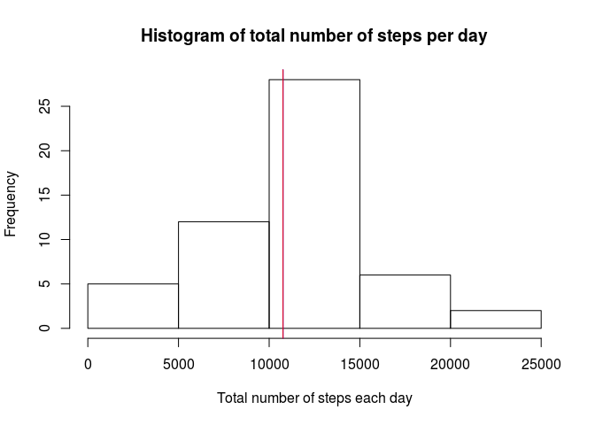
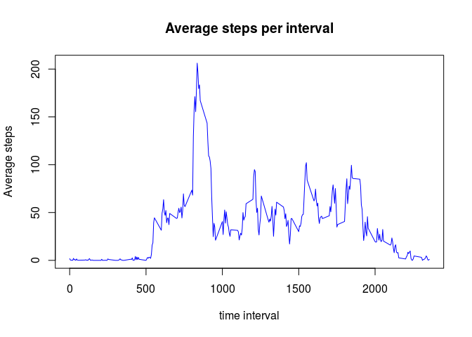
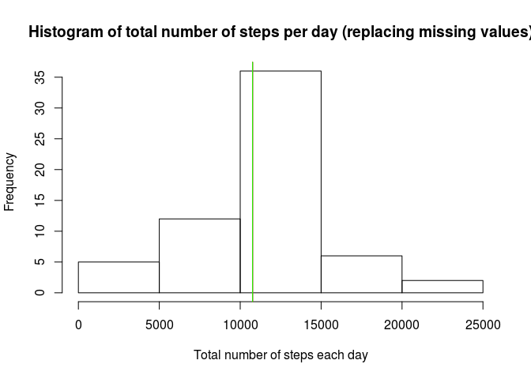
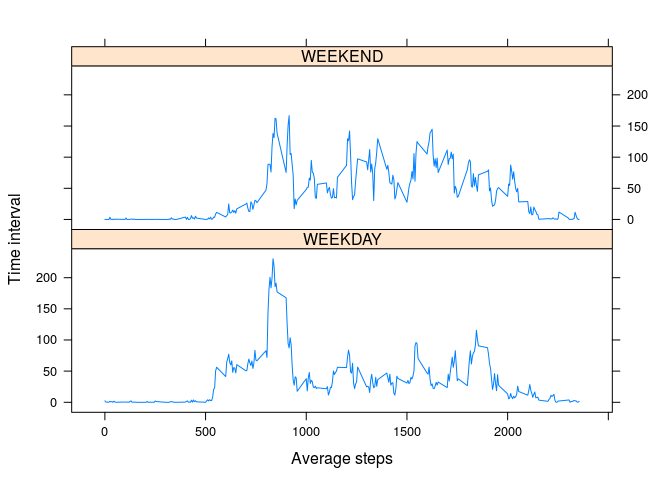

# Reproducible Research: Peer Assessment 1
Vannia Gonzalez  
November 21, 2016  


## Loading and preprocessing the data


```r
unzip("activity.zip")
data<-read.csv("activity.csv",sep=",",header = TRUE,stringsAsFactors = FALSE)
library(lubridate)
data$date<-as.POSIXct(data$date,format="%Y-%m-%d")
```

## What is mean total number of steps taken per day?

Total steps per day

```r
daily_sum<-aggregate(data$steps ~ strftime(data$date, "%m-%d"), FUN = sum,na.rm=TRUE)
#steps_daily<-data%>%group_by(date)%>%summarise(tot=sum(steps,na.rm=TRUE))   //uses dplyr,plyr
```

Histogram: steps per day

```r
hist(daily_sum$`data$steps`,xlab="Total number of steps each day",main="Histogram of total number of steps per day")
abline(v=mean(daily_sum$`data$steps`),col="blue")
abline(v=median(daily_sum$`data$steps`),col="red")
```


The blue and red vertical lines show the values for the mean and median, respectively, for the average steps each day, given explicitely by:  

**1. Mean**

```r
mean(daily_sum$`data$steps`,na.rm=TRUE)
```

```
## [1] 10766.19
```
**2. Median**

```r
median(daily_sum$`data$steps`,na.rm=TRUE)
```

```
## [1] 10765
```

## What is the average daily activity pattern?

```r
avg_interval<-setNames(aggregate(data$steps~data$interval,FUN=mean,na.rm=TRUE),c("int","avg"))
```

```r
with(avg_interval,plot(int,avg,type="l",xlab="time interval",ylab="Average steps",main="Average steps per interval",col="blue"))
```

<!-- -->

```r
m<-avg_interval$int[which(avg_interval$avg==max(avg_interval$avg))]
```
  
**Interval with maximum number of average steps across all days: 835**


## Imputing missing values


```r
m<-sum(is.na(data$steps))
```
Total number of missing values: 2304


In the next step I fill the missing values in the steps variable with the average steps (across all days) made within the corresponding interval 

```r
data2<-data
for(i in 1:nrow(data2)){ 
        if(is.na(data2$steps[i])){
                inum<-data2[i,3] #nterval number
                data2$steps[i]<-avg_interval[avg_interval$int==inum,2]
        }
        
}
```
Verify that the total missing values are now zero.

```r
sum(is.na(data2$steps))
```

```
## [1] 0
```

Histogram with new dataset


```r
daily_sum2<-aggregate(data2$steps ~ strftime(data2$date, "%m-%d"), FUN = sum,na.rm=TRUE)
hist(daily_sum2$`data2$steps`,xlab="Total number of steps each day",main="Histogram of total number of steps per day (replacing missing values)")
abline(v=mean(daily_sum2$`data2$steps`),col="blue")
abline(v=median(daily_sum2$`data2$steps`),col="red")
abline(v=mean(daily_sum$`data$steps`),col="orange")
abline(v=median(daily_sum$`data$steps`),col="green")
```


The former plot shows a histogram of the average steps per day when replacing the missing values for the step variable with a reasonable value such as the average steps across all days for the corresponding interval for each missing value (dataset 2). Note that this histogram is not significantly different from that, ignoring the missing values (first figure of this report).
I plotted in different colors the means and medians for both datasets but these are apparently indistinguishable (they overlap).

Explicitly the mean and median are given by:

**1. Mean for second dataset**

```r
mean(daily_sum2$`data2$steps`)
```

```
## [1] 10766.19
```

**2. Median for second dataset**

```r
median(daily_sum2$`data2$steps`)
```

```
## [1] 10766.19
```

If we compare both datasets quantiles we see there is no significant impact in the set of values for each interval limit.


```r
summary(daily_sum$`data$steps`)
```

```
##    Min. 1st Qu.  Median    Mean 3rd Qu.    Max. 
##      41    8841   10760   10770   13290   21190
```

```r
summary(daily_sum2$`data2$steps`)
```

```
##    Min. 1st Qu.  Median    Mean 3rd Qu.    Max. 
##      41    9819   10770   10770   12810   21190
```

## Are there differences in activity patterns between weekdays and weekends?
Using the second dataset I create a factor variable with two levels – “weekday” and “weekend” indicating whether a given date is a weekday or weekend day.

```r
data2$date<-factor(weekdays(data2$date),levels=unique(weekdays(data2$date)))
levels(data2$date)<-c(rep("WEEKDAY",5),"WEEKEND","WEEKEND")
```

Average steps across all weekdays or weekends for each interval

```r
avg_interval2<-setNames(aggregate(data2$steps,list(data2$interval,data2$date),FUN=mean),c("int","wtype","avg"))
```


```r
library(lattice)
xyplot(avg~int|wtype,data=avg_interval2, 
        type="l", 
        ylab="Time interval", xlab="Average steps",
	      layout=c(1,2) 
)
```

<!-- -->
